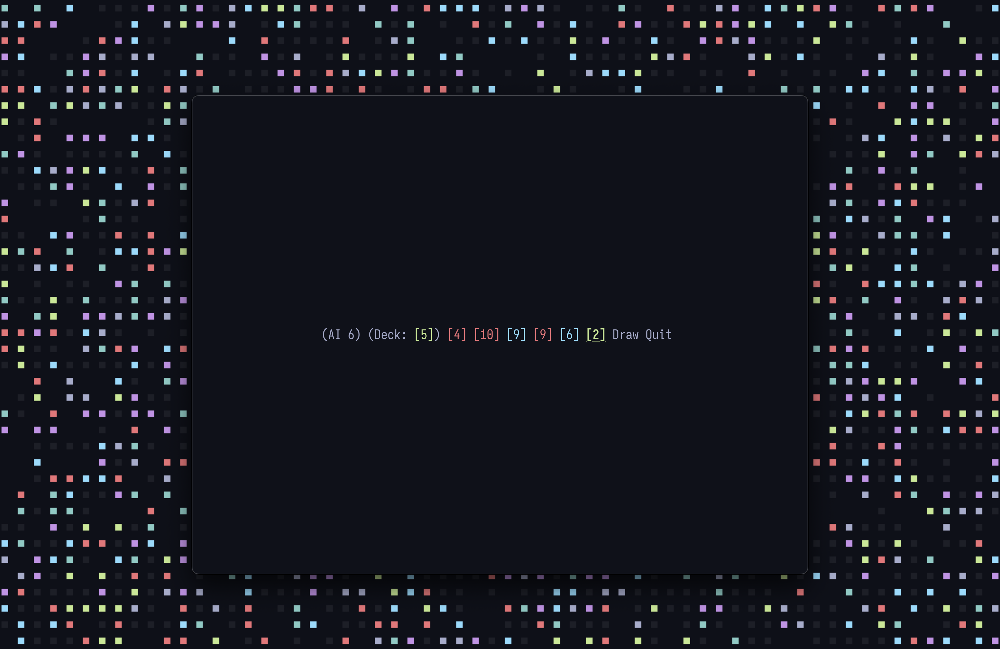

# Uno-CLI

## Install

### With Cargo Installed

```shell
$ cargo install uno-cli
```

### Building from Source

```shell
$ git clone https://github.com/benraz123/uno
$ cd uno
$ cargo run
```

## What is this?

`uno-cli` is an attempt to model [Uno](https://en.wikipedia.org/wiki/Uno_(card_game)) in a command line context.

### How does `Uno-CLI` work?

To launch, write `uno-cli`. Use WASD/HJKL keys to select cards. A card can be played if it is a wild card, or if it is the same number or same color or both.

## Default Keybindings

| Key | Action |
|-----|--------|
| <kbd>a</kbd> / <kbd>h</kbd> | Move cursor one to the left |
| <kbd>d</kbd> / <kbd>l</kbd> | Move cursor one to the right | 
| <kbd>Enter</kbd> | Select Option |

## Progress

- [x] Get basic game running
- [ ] Add skip card
- [ ] Add draw two card
- [ ] Add wild card
- [ ] Add wild draw four card
